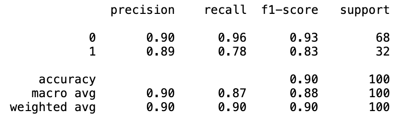

# SUV Car Purchase Prediction

1. This project uses data from customers who already bought a car from a dealership and uses various classification models to learn from the dataset, and to predict if any future customer will buy a SUV car from that dealership or not.  

2. K Nearest Neighbors, Artificial Neural Network, and Support Vector Machine classification models classified the data most accurately. These three classification models can be used to predict any future customers at this dealership, if they have more chances of buying a SUV or not.    

3. The data analysis for this project followed the following sequential steps:
* Split the dataset into training and testing data.    
* Scale the data.     
* Apply the classification model.    
* Predict the result.    
* Present the Data Analysis results: Confusion Matrix and Classification Report.    

3. Listed below are the Confusion Matrix and Classification Report of the various Classification models used in this project, arranged in order of decreasing accuracy:

## K Nearest Neighbor

**Confusion Matrix**    
    

**Classification Report**    

## Artificial Neural Network   

**Confusion Matrix**    

**Classification Report**    
    

## Kernel Support Vector Machine    

**Confusion Matrix**    
  

**Classification Report**    
    

## Logistic Regression    

**Confusion Matrix**    
  

**Classification Report**    
    

## Naive Bayes    

**Confusion Matrix**    
  

**Classification Report**    
    

## Random    

**Confusion Matrix**    
  

**Classification Report**    
    

## Support Vector Nachine    

**Confusion Matrix**    
  

**Classification Report**    

